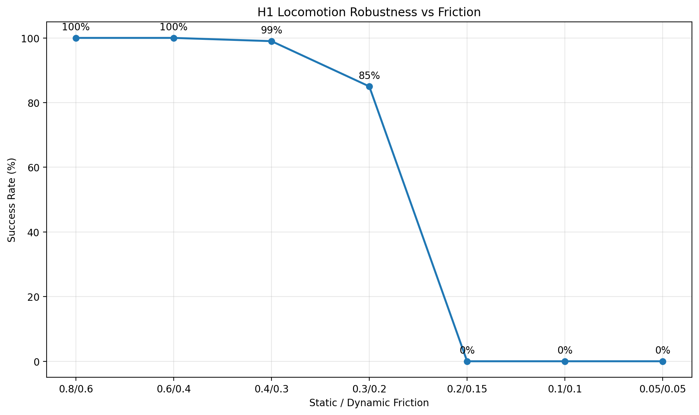
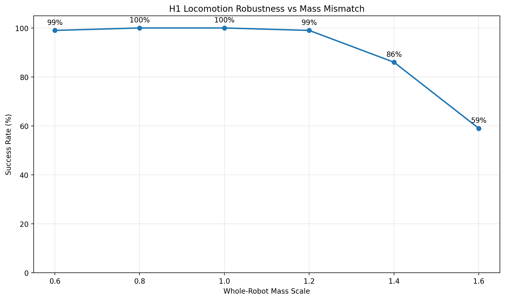

# Humanoid Simulation Robustness Benchmark

A reproducible robotics simulation and evaluation project for **Unitree H1 humanoid locomotion in NVIDIA Isaac Lab**.

The project goes beyond training a locomotion policy: it builds an independent benchmark layer around a frozen PPO policy to measure how humanoid behavior changes under controlled **physics and model mismatch**.

## Overview

```text
Unitree H1
    ↓
Isaac Lab locomotion environment
    ↓
RSL-RL PPO training
    ↓
Frozen trained policy
    ↓
Independent benchmark runner
    ↓
Controlled physics perturbations
    ├── Contact friction
    └── Robot mass
    ↓
Episode-based evaluation
    ├── Survival rate
    ├── Fall rate
    ├── Velocity RMSE
    ├── Base tilt
    └── Joint-limit violations
    ↓
JSON results + robustness plots
```

The focus is **simulation validation and robustness engineering**: keeping the controller fixed while deliberately changing assumptions in the simulated physical model and measuring how behavior degrades.

## What I Implemented

The H1 robot model, locomotion task, and PPO implementation come from Isaac Lab / RSL-RL.

The engineering work in this repository is the evaluation and robustness layer built around them:

- trained and froze a dedicated H1 locomotion policy
- built an external benchmark runner independent of Isaac Lab's standard playback script
- implemented episode-consistent metric collection
- distinguished timeout survival from early termination
- aligned velocity metrics with the coordinate frames used by the H1 task
- implemented mean base-tilt measurement
- implemented soft joint-limit violation tracking
- implemented deterministic contact-friction overrides
- implemented deterministic whole-robot mass scaling with inertia recomputation
- built automated friction and mass sweeps
- generated machine-readable JSON experiment results
- built automated plotting utilities
- added configuration-driven experiments through YAML
- built resumable multi-seed experiment execution

This project is not presented as a new PPO algorithm or a new humanoid model. Its contribution is a **reproducible simulation benchmarking and model-mismatch evaluation framework**.

## Baseline Policy

| Parameter | Value |
|---|---:|
| Robot | Unitree H1 |
| Task | `Isaac-Velocity-Flat-H1-v0` |
| Algorithm | PPO — RSL-RL |
| Parallel environments | 1024 |
| Training iterations | 1500 |
| Total transitions | 36,864,000 |
| Training seed | 42 |
| Final mean reward | 30.96 |
| Final mean episode length | 993.30 |
| Training throughput | ~25,577 steps/s |
| Training time | ~27 min |

The frozen policy used by the benchmark is stored at:

`baseline_checkpoints/baseline_v1.pt`

Its metadata is stored in:

`baseline_checkpoints/baseline_v1.yaml`

## Finalized Nominal Benchmark

The benchmark evaluates 100 episodes across 64 vectorized environments.

| Metric | Result |
|---|---:|
| Survival rate | **100.00%** |
| Fall rate | **0.00%** |
| Mean episode length | **1000.00 steps** |
| Linear velocity RMSE | **0.0807 m/s** |
| Yaw velocity RMSE | **0.1395 rad/s** |
| Mean base tilt | **2.99°** |
| Joint-limit violation rate | **0.0979%** |

A successful episode is defined as `survival_to_timeout`: the robot reaches the configured episode time limit without triggering an early termination.

This should be interpreted as a **locomotion survival/stability metric**, not as reaching a navigation goal.

## Contact-Friction Robustness

The same frozen policy was evaluated under progressively reduced rigid-body contact-friction settings.



| Static / Dynamic Friction | Survival Rate |
|---|---:|
| 0.8 / 0.6 | 100% |
| 0.6 / 0.4 | 100% |
| 0.4 / 0.3 | 99% |
| 0.3 / 0.2 | 85% |
| 0.2 / 0.15 | 0% |
| 0.1 / 0.1 | 0% |
| 0.05 / 0.05 | 0% |

The initial sweep shows a clear transition from stable locomotion to severe failure as contact friction is reduced.

These values are treated as a **controlled single-seed robustness sweep**, not as an exact physical failure threshold.

## Mass-Model Mismatch

The benchmark can apply a deterministic multiplier to every rigid body in the H1 articulation while recomputing inertia consistently.

This creates a controlled **systematic model mismatch** while keeping the policy unchanged.



| Whole-Robot Mass Scale | Survival Rate |
|---|---:|
| 0.6x | 99% |
| 0.8x | 100% |
| 1.0x | 100% |
| 1.2x | 99% |
| 1.4x | 86% |
| 1.6x | 59% |

The policy remains highly robust around nominal mass but degrades substantially as the simulated robot becomes heavier.

The range is intentionally broad and should be interpreted as a **simulation stress test**, not as expected manufacturing tolerance.

## Evaluation Metrics

**Survival rate**  
Fraction of counted episodes that survive until the configured timeout.

**Fall rate**  
Fraction of counted episodes that terminate before timeout.

**Linear velocity RMSE**  
XY commanded velocity versus simulated H1 velocity in the gravity-aligned yaw frame.

**Yaw velocity RMSE**  
Commanded yaw rate versus the robot's world-frame z angular velocity.

**Mean base tilt**  
Angular deviation of the robot base from upright, calculated using projected gravity in the base frame.

**Joint-limit violation rate**  
Fraction of joint-time observations for which a joint position lies outside Isaac Lab's configured soft joint-position limits.

## Reproducibility

Core environment used during development:

```text
Isaac Lab: v2.3.2
RSL-RL:    3.1.2
Python:    3.11
GPU simulation: CUDA
```

Run the nominal benchmark:

```powershell
python benchmark/run_benchmark.py --config configs/baseline_nominal.yaml
```

Run the friction sweep:

```powershell
python scripts/run_friction_sweep.py --config configs/friction_sweep.yaml
```

Run the mass sweep:

```powershell
python scripts/run_mass_sweep.py --config configs/mass_sweep.yaml
```

Run the configured multi-seed benchmark:

```powershell
python scripts/run_multiseed_benchmark.py --config configs/multiseed_benchmark.yaml
```

The benchmark writes structured `results.json` files so results can be compared or processed programmatically.

## Repository Structure

```text
Humanoid-Benchmark/
│
├── baseline_checkpoints/
│   ├── baseline_v1.pt
│   └── baseline_v1.yaml
│
├── benchmark/
│   └── run_benchmark.py
│
├── configs/
│   ├── baseline_nominal.yaml
│   ├── friction_sweep.yaml
│   ├── mass_sweep.yaml
│   └── multiseed_benchmark.yaml
│
├── docs/
│   └── assets/
│       ├── friction_success_rate.png
│       └── mass_success_rate.png
│
├── reports/
│   └── baseline_v1_nominal/
│       └── results.json
│
└── scripts/
    ├── compare_results.py
    ├── plot_friction_sweep.py
    ├── plot_mass_sweep.py
    ├── run_friction_sweep.py
    ├── run_mass_sweep.py
    └── run_multiseed_benchmark.py
```

## Why This Project

A policy that works under one nominal simulator configuration does not by itself demonstrate robustness.

For sim-to-real robotics, relevant questions include:

- How sensitive is the controller to inaccurate physical parameters?
- Which simulator assumptions matter most?
- Does tracking performance degrade before the robot begins falling?
- Can the same evaluation be reproduced automatically?
- Can changes to a controller or simulator configuration be regression-tested?

This project treats simulation as an **engineering validation environment**, rather than only as a place to train an RL policy.

## Tools

- NVIDIA Isaac Lab / Isaac Sim
- Unitree H1
- PyTorch
- RSL-RL
- PPO
- Gymnasium
- Python
- YAML
- Matplotlib
