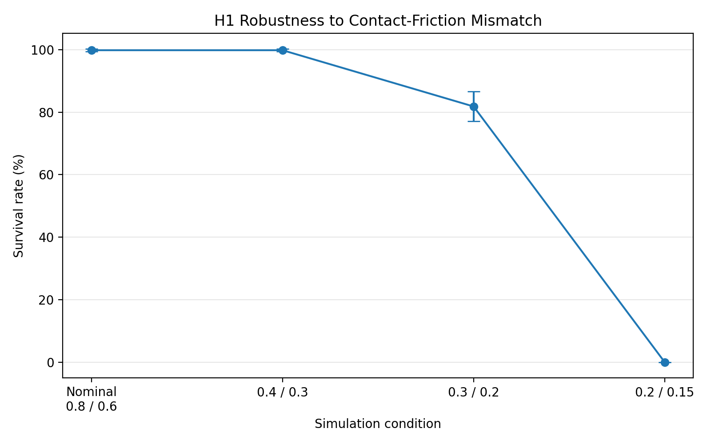
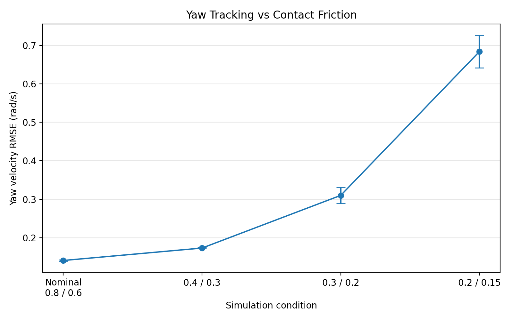
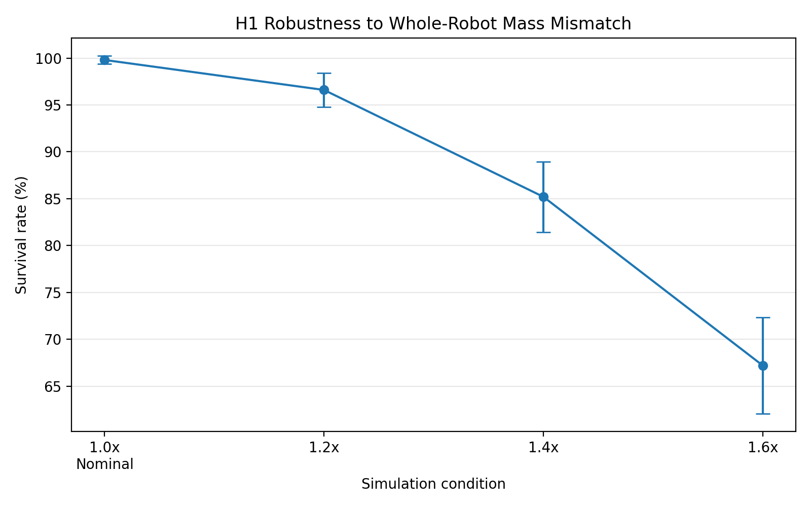
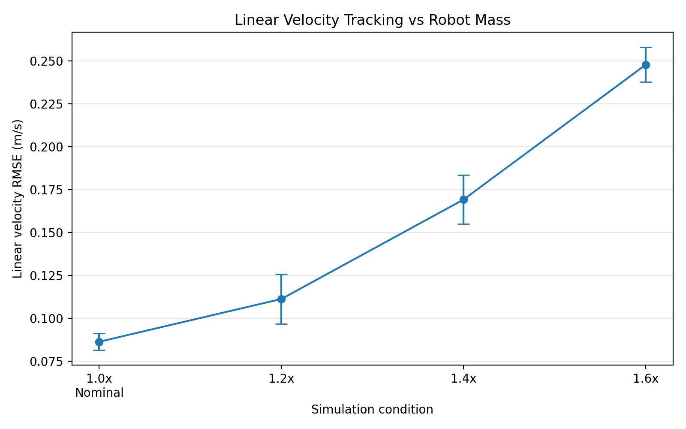
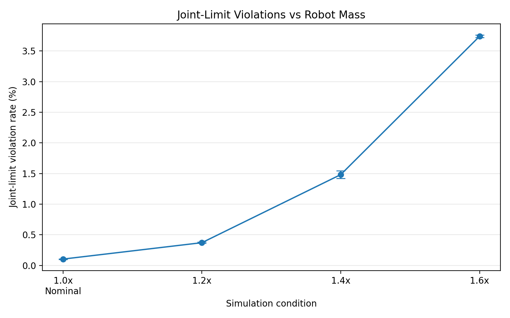

# Humanoid Simulation Robustness Benchmark

A reproducible robotics simulation and evaluation project for **Unitree H1 humanoid locomotion in NVIDIA Isaac Lab**.

The project goes beyond training a locomotion policy: it builds an independent benchmark layer around a frozen PPO policy to measure how humanoid behavior changes under controlled **physics and model mismatch**.

### Current benchmark scale

**35 multi-seed simulation runs · 3,500 evaluated episodes · 7 physics conditions · 5 evaluation seeds**

## Overview

```text
Unitree H1
    ↓
Isaac Lab locomotion environment
    ↓
RSL-RL PPO training
    ↓
Frozen trained policy
    ↓
Independent benchmark runner
    ↓
Controlled physics perturbations
    ├── Contact friction
    └── Robot mass
    ↓
Episode-based evaluation
    ├── Survival rate
    ├── Fall rate
    ├── Velocity RMSE
    ├── Base tilt
    └── Joint-limit violations
    ↓
JSON results + robustness plots
```

The focus is **simulation validation and robustness engineering**: keeping the controller fixed while deliberately changing assumptions in the simulated physical model and measuring how behavior degrades.

## What I Implemented

The H1 robot model, locomotion task, and PPO implementation come from Isaac Lab / RSL-RL.

The engineering work in this repository is the evaluation and robustness layer built around them:

- trained and froze a dedicated H1 locomotion policy
- built an external benchmark runner independent of Isaac Lab's standard playback script
- implemented episode-consistent metric collection
- distinguished timeout survival from early termination
- aligned velocity metrics with the coordinate frames used by the H1 task
- implemented mean base-tilt measurement
- implemented soft joint-limit violation tracking
- implemented deterministic contact-friction overrides
- implemented deterministic whole-robot mass scaling with inertia recomputation
- built automated friction and mass sweeps
- generated machine-readable JSON experiment results
- built automated plotting utilities
- added configuration-driven experiments through YAML
- built automated multi-seed robustness experiments with resumable execution
- implemented statistical aggregation using mean, sample standard deviation, minimum, and maximum across evaluation seeds

This project is not presented as a new PPO algorithm or a new humanoid model. Its contribution is a **reproducible simulation benchmarking and model-mismatch evaluation framework**.

## Baseline Policy

| Parameter | Value |
|---|---:|
| Robot | Unitree H1 |
| Task | `Isaac-Velocity-Flat-H1-v0` |
| Algorithm | PPO — RSL-RL |
| Parallel environments | 1024 |
| Training iterations | 1500 |
| Total transitions | 36,864,000 |
| Training seed | 42 |
| Final mean reward | 30.96 |
| Final mean episode length | 993.30 |
| Training throughput | ~25,577 steps/s |
| Training time | ~27 min |

The frozen policy used by the benchmark is stored at:

`baseline_checkpoints/baseline_v1.pt`

Its metadata is stored in:

`baseline_checkpoints/baseline_v1.yaml`

## Finalized Nominal Benchmark

The benchmark evaluates 100 episodes across 64 vectorized environments.

| Metric | Result |
|---|---:|
| Survival rate | **100.00%** |
| Fall rate | **0.00%** |
| Mean episode length | **1000.00 steps** |
| Linear velocity RMSE | **0.0807 m/s** |
| Yaw velocity RMSE | **0.1395 rad/s** |
| Mean base tilt | **2.99°** |
| Joint-limit violation rate | **0.0979%** |

A successful episode is defined as `survival_to_timeout`: the robot reaches the configured episode time limit without triggering an early termination.

This should be interpreted as a **locomotion survival/stability metric**, not as reaching a navigation goal.

## Multi-Seed Robustness Evaluation

To test whether the observed robustness trends were reproducible rather than specific to a single evaluation seed, the frozen baseline policy was evaluated across:

- **5 evaluation seeds:** 42, 123, 456, 789, 2026
- **7 physics scenarios**
- **100 completed episodes per scenario/seed combination**
- **35 benchmark runs**
- **3,500 evaluated episodes**

All values below report **mean ± sample standard deviation across the five evaluation seeds**.

The same frozen controller is used in every experiment. Only the simulated physical model is changed.

---

## Contact-Friction Robustness

The H1 policy was evaluated under progressively reduced rigid-body contact-friction settings.



| Static / Dynamic Friction | Survival Rate |
|---|---:|
| Nominal (0.8 / 0.6) | **99.8 ± 0.45%** |
| 0.4 / 0.3 | **99.8 ± 0.45%** |
| 0.3 / 0.2 | **81.8 ± 4.76%** |
| 0.2 / 0.15 | **0.0 ± 0.0%** |

The policy remains highly stable at moderate friction mismatch, but a clear degradation region appears at `0.3 / 0.2`. Under the stronger `0.2 / 0.15` perturbation, all evaluated episodes terminate early across all five seeds.

This should be interpreted as an **observed transition region within the tested parameter grid**, rather than an exact physical failure threshold.

### Tracking degradation

Survival alone can hide deterioration in controller performance before complete failure.



Mean yaw-velocity tracking RMSE increased from approximately:

| Static / Dynamic Friction | Yaw RMSE |
|---|---:|
| Nominal | **0.141 ± 0.002 rad/s** |
| 0.4 / 0.3 | **0.173 ± 0.002 rad/s** |
| 0.3 / 0.2 | **0.310 ± 0.021 rad/s** |
| 0.2 / 0.15 | **0.684 ± 0.042 rad/s** |

An important observation is that at `0.4 / 0.3`, survival remains essentially unchanged while yaw-tracking error has already increased. This illustrates why robustness evaluation benefits from continuous control-performance metrics in addition to binary survival/failure measurements.

---

## Mass-Model Mismatch

A second experiment systematically scales every rigid-body mass in the H1 articulation while recomputing inertia, leaving the trained policy unchanged.

This creates a controlled model mismatch between the dynamics the controller was trained on and the dynamics used during evaluation.



| Whole-Robot Mass Scale | Survival Rate |
|---|---:|
| 1.0x nominal | **99.8 ± 0.45%** |
| 1.2x | **96.6 ± 1.82%** |
| 1.4x | **85.2 ± 3.77%** |
| 1.6x | **67.2 ± 5.12%** |

Unlike the sharp failure transition observed in the tested friction conditions, mass scaling produces a more gradual degradation over the evaluated range.

The tested mass range is intentionally broad and represents a **simulation stress test**, not expected manufacturing tolerance.

### Velocity tracking under mass mismatch



Linear velocity tracking error increased progressively with mass mismatch:

| Whole-Robot Mass Scale | Linear Velocity RMSE |
|---|---:|
| 1.0x | **0.086 ± 0.005 m/s** |
| 1.2x | **0.111 ± 0.015 m/s** |
| 1.4x | **0.169 ± 0.014 m/s** |
| 1.6x | **0.248 ± 0.010 m/s** |

The combination of decreasing survival and increasing tracking error shows progressive controller degradation rather than only a binary transition between walking and falling.

### Joint-limit behavior

Mass mismatch also produces a strong increase in joint-limit violations.



The increased violation rate indicates that larger mass mismatch is associated with the fixed controller operating increasingly close to, or beyond, the configured soft joint limits.

This is an observed association in the benchmark; the experiment does not isolate a single underlying causal mechanism.

---

## Key Findings

Across the tested perturbation ranges:

1. **Contact friction produced a sharper failure transition than uniform mass scaling.**

2. **Controller degradation can appear before the robot starts falling.**  
   At moderate friction mismatch, survival remained near nominal while yaw-tracking accuracy had already deteriorated.

3. **Mass mismatch produced progressive degradation across multiple metrics.**  
   Survival decreased while velocity-tracking error and joint-limit violations increased.

4. **The trends were reproducible across five evaluation seeds.**  
   Error bars represent sample standard deviation across independent evaluation seeds rather than variation within a single run.

The complete aggregated statistics, including base tilt, episode length, fall rate, and all tracking metrics, are available in:

`docs/multiseed_aggregated_results.json`

## Evaluation Metrics

**Survival rate**  
Fraction of counted episodes that survive until the configured timeout.

**Fall rate**  
Fraction of counted episodes that terminate before timeout.

**Linear velocity RMSE**  
XY commanded velocity versus simulated H1 velocity in the gravity-aligned yaw frame.

**Yaw velocity RMSE**  
Commanded yaw rate versus the robot's world-frame z angular velocity.

**Mean base tilt**  
Angular deviation of the robot base from upright, calculated using projected gravity in the base frame.

**Joint-limit violation rate**  
Fraction of joint-time observations for which a joint position lies outside Isaac Lab's configured soft joint-position limits.

## Reproducibility

Core environment used during development:

```text
Isaac Lab: v2.3.2
RSL-RL:    3.1.2
Python:    3.11
GPU simulation: CUDA
```

Run the nominal benchmark:

```powershell
python benchmark/run_benchmark.py --config configs/baseline_nominal.yaml
```

Run the friction sweep:

```powershell
python scripts/run_friction_sweep.py --config configs/friction_sweep.yaml
```

Run the mass sweep:

```powershell
python scripts/run_mass_sweep.py --config configs/mass_sweep.yaml
```

Run the configured multi-seed benchmark:

```powershell
python scripts/run_multiseed_benchmark.py --config configs/multiseed_benchmark.yaml
```

The benchmark writes structured `results.json` files so results can be compared or processed programmatically.

So the full section should look like:

```markdown
## Repository Structure
```texts
Humanoid-Benchmark/
│
├── baseline_checkpoints/
│   ├── baseline_v1.pt
│   └── sbaseline_v1.yaml
│
├── benchmark/
│   └── run_benchmark.py
│
├── configs/
│   ├── baseline_nominal.yaml
│   ├── friction_sweep.yaml
│   ├── mass_sweep.yaml
│   └── multiseed_benchmark.yaml
│
├── docs/
│   ├── multiseed_aggregated_results.json
│   └── assets/
│       ├── multiseed_friction_success_rate.png
│       ├── multiseed_friction_yaw_rmse.png
│       ├── multiseed_mass_success_rate.png
│       ├── multiseed_mass_linear_rmse.png
│       └── multiseed_mass_joint_limit_violations.png
│
├── reports/
│   └── baseline_v1_nominal/
│       └── results.json
│
└── scripts/
    ├── aggregate_multiseed_results.py
    ├── compare_results.py
    ├── plot_friction_sweep.py
    ├── plot_mass_sweep.py
    ├── plot_multiseed_results.py
    ├── run_friction_sweep.py
    ├── run_mass_sweep.py
    └── run_multiseed_benchmark.py

## Why This Project

A policy that works under one nominal simulator configuration does not by itself demonstrate robustness.

For sim-to-real robotics, relevant questions include:

- How sensitive is the controller to inaccurate physical parameters?
- Which simulator assumptions matter most?
- Does tracking performance degrade before the robot begins falling?
- Can the same evaluation be reproduced automatically?
- Can changes to a controller or simulator configuration be regression-tested?

This project treats simulation as an **engineering validation environment**, rather than only as a place to train an RL policy.

## Tools

- NVIDIA Isaac Lab / Isaac Sim
- Unitree H1
- PyTorch
- RSL-RL
- PPO
- Gymnasium
- Python
- YAML
- Matplotlib
