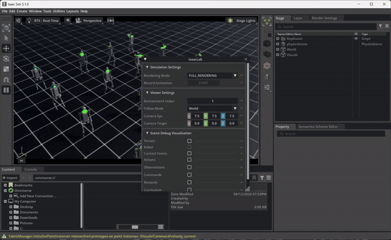
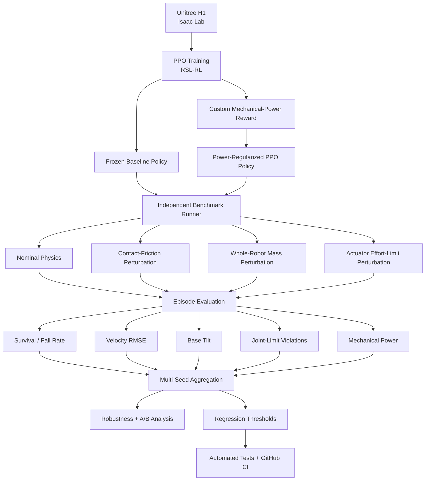
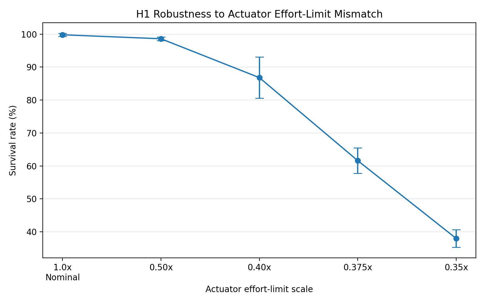

# Humanoid Simulation Robustness Benchmark

A reproducible **robotics simulation validation and controller-evaluation framework** for Unitree H1 humanoid locomotion in NVIDIA Isaac Lab.

I trained and froze a PPO locomotion controller, built an independent robustness benchmark around it, stress-tested the policy under controlled physics, model, and actuator mismatch, and then extended the locomotion task with a custom mechanical-power regularization term to study the trade-off between lower-power behavior and robustness.

**95 formal simulation runs · 9,500 evaluated episodes · 5 evaluation seeds · 44 automated tests + CI**

---

## What This Project Demonstrates

- GPU-parallel humanoid simulation in NVIDIA Isaac Lab
- PPO locomotion training using RSL-RL
- independent evaluation infrastructure around frozen policies
- controlled contact-friction, whole-robot mass, and actuator-effort perturbations
- survival, velocity-tracking, base-tilt, joint-limit, and mechanical-power metrics
- custom reward design for mechanical-power regularization
- retraining and matched policy A/B evaluation
- automated multi-seed experiments
- statistical aggregation across evaluation seeds
- configuration-driven and resumable benchmark execution
- regression thresholds
- CPU-only unit tests
- GitHub Actions CI
- reproducible simulation validation workflows

The project treats simulation as an **engineering validation, stress-testing, and regression-testing environment**, rather than only as a place to train an RL controller.

---

## Key Results

### Baseline Robustness

The frozen baseline controller remained highly stable under moderate mismatch while continuous metrics exposed degradation before complete failure.

- nominal survival: **99.8 ± 0.45%**
- contact friction `0.4 / 0.3`: **99.8 ± 0.45% survival**
- contact friction `0.3 / 0.2`: **81.8 ± 4.76% survival**
- contact friction `0.2 / 0.15`: **0.0 ± 0.0% survival**
- whole-robot mass `1.0x → 1.6x`: survival decreased from **99.8% → 67.2%**
- actuator effort `1.0x → 0.35x`: survival decreased from **99.8% → 38.0%**
- actuator linear-velocity RMSE increased from approximately **0.086 → 0.276 m/s**

Within the tested perturbation ranges, contact-friction mismatch produced a sharper failure transition, while whole-robot mass scaling produced more gradual degradation.

### Custom Reward A/B Experiment

A second policy was trained with a custom simulated mechanical-power penalty.

Across four matched evaluation conditions, the retrained policy reduced mean simulated mechanical actuator power by approximately:

- **43.9%** under nominal dynamics
- **39.7%** under contact friction `0.3 / 0.2`
- **53.0%** under `1.4x` whole-robot mass
- **35.2%** under `0.4x` actuator effort limits

Under nominal dynamics:

- survival remained **99.8%**
- mechanical power decreased from **242.29 W → 135.83 W**
- velocity tracking remained broadly similar

However, the lower-power policy was **not universally more robust**:

- contact-friction robustness decreased
- mass-mismatch robustness decreased
- reduced-actuator-effort robustness improved
- base tilt increased
- joint-limit violations increased

This makes the experiment a useful example of **multi-objective controller design**: improving one objective can shift performance elsewhere, so retrained policies must be independently validated rather than judged only by the training reward.

---

# Simulation Demo

## Nominal H1 Locomotion

A Unitree H1 PPO controller trained for this project running in NVIDIA Isaac Lab across parallel simulation environments.



---

# Project Scope

## What Comes From Isaac Lab / RSL-RL

The following components are based on the standard Isaac Lab / RSL-RL stack:

- Unitree H1 robot model
- `Isaac-Velocity-Flat-H1-v0` locomotion environment
- observation definitions
- action definitions
- baseline reward structure
- termination logic
- RSL-RL PPO implementation

The project does **not** claim to implement the H1 environment or PPO algorithm from scratch.

## What Is Implemented in This Repository

The original engineering contribution is the training, evaluation, validation, and experimentation infrastructure around the controller:

- trained and froze a dedicated H1 PPO locomotion policy
- external benchmark runner independent of the standard playback script
- YAML-based evaluation configuration
- episode-consistent metric collection
- timeout-survival versus early-termination classification
- velocity-tracking RMSE aligned with the H1 task coordinate frames
- mean base-tilt measurement
- soft joint-limit violation tracking
- simulated mechanical actuator-power measurement
- deterministic rigid-body contact-friction perturbations
- deterministic whole-robot mass scaling with inertia recomputation
- deterministic whole-robot actuator effort-limit scaling
- automated friction, mass, and actuator-effort sweeps
- resumable multi-seed benchmark execution
- statistical aggregation across evaluation seeds
- JSON result export
- robustness plotting utilities
- regression thresholds
- simulator-independent validation logic
- custom mechanical-power reward term
- second PPO training run using the custom reward
- matched baseline-versus-power-regularized A/B evaluation
- 44 automated tests
- GitHub Actions CI

---

# Benchmark Architecture



---

# Baseline Policy

The benchmark uses a PPO controller trained specifically for this project rather than an externally supplied pretrained checkpoint.

| Parameter | Value |
|---|---:|
| Robot | Unitree H1 |
| Task | `Isaac-Velocity-Flat-H1-v0` |
| Algorithm | PPO — RSL-RL |
| Parallel training environments | 1024 |
| Training iterations | 1500 |
| Total environment transitions | 36,864,000 |
| Training seed | 42 |
| Final mean reward | 30.96 |
| Final mean episode length | 993.30 |
| Training throughput | ~25,577 steps/s |
| Training time | ~27 min |

Frozen checkpoint:

```text
baseline_checkpoints/baseline_v1.pt
```

Policy metadata:

```text
baseline_checkpoints/baseline_v1.yaml
```

---

# Nominal Benchmark

A finalized nominal benchmark was run for **100 completed episodes across 64 vectorized environments**.

| Metric | Result |
|---|---:|
| Survival rate | **100.00%** |
| Fall rate | **0.00%** |
| Mean episode length | **1000.00 steps** |
| Linear velocity RMSE | **0.0807 m/s** |
| Yaw velocity RMSE | **0.1395 rad/s** |
| Mean base tilt | **2.99°** |
| Joint-limit violation rate | **0.0979%** |
| Mean mechanical power | **240.73 W** |

A successful episode is defined as:

```text
survival_to_timeout
```

The robot must reach the configured episode time limit without an early termination.

Therefore, **survival rate is a locomotion-stability metric, not a navigation-goal success metric**.

---

# Multi-Seed Robustness Evaluation

The same frozen baseline controller was evaluated under controlled simulation mismatch.

## Evaluation Protocol

- **5 evaluation seeds:** `42`, `123`, `456`, `789`, `2026`
- **11 simulation conditions**
- **100 completed episodes per scenario / seed**
- **55 total simulation runs**
- **5,500 evaluated episodes**
- **64 parallel environments per run**

Reported uncertainty is:

```text
mean ± sample standard deviation across evaluation seeds
```

The error bars represent variation across the five evaluation seeds.

They are **not** confidence intervals or statistical-significance claims.

---

# Contact-Friction Robustness

The robot rigid-body contact material was modified while the frozen controller remained unchanged.

This is a **rigid-body contact-friction perturbation**, not purely a terrain-friction experiment.


| Static / Dynamic Friction | Survival Rate |
|---|---:|
| Nominal `0.8 / 0.6` | **99.8 ± 0.45%** |
| `0.4 / 0.3` | **99.8 ± 0.45%** |
| `0.3 / 0.2` | **81.8 ± 4.76%** |
| `0.2 / 0.15` | **0.0 ± 0.0%** |

The tested friction range shows a transition from stable locomotion to severe degradation.

This is an **observed transition region in the tested parameter grid**, not a universal physical failure threshold for Unitree H1.

## Yaw Tracking Under Friction Mismatch


| Static / Dynamic Friction | Yaw RMSE |
|---|---:|
| Nominal | **0.141 ± 0.002 rad/s** |
| `0.4 / 0.3` | **0.173 ± 0.002 rad/s** |
| `0.3 / 0.2` | **0.310 ± 0.021 rad/s** |
| `0.2 / 0.15` | **0.684 ± 0.042 rad/s** |

At `0.4 / 0.3`, survival remains almost identical to nominal while yaw-tracking error has already increased.

This demonstrates why **continuous controller-performance metrics can expose degradation before binary fall-rate metrics do**.

---

# Whole-Robot Mass Robustness

A deterministic scale factor was applied to all H1 rigid-body masses.

The perturbation recomputes inertia and is intended as a controlled **whole-robot model-mismatch stress test**.

It should not be interpreted as a specific payload or manufacturing-tolerance model.


| Mass Scale | Survival Rate | Linear RMSE |
|---|---:|---:|
| `1.0x` | **99.8 ± 0.45%** | **0.086 ± 0.005 m/s** |
| `1.2x` | **96.6 ± 1.82%** | **0.111 ± 0.015 m/s** |
| `1.4x` | **85.2 ± 3.77%** | **0.169 ± 0.014 m/s** |
| `1.6x` | **67.2 ± 5.12%** | **0.248 ± 0.010 m/s** |

Performance degraded progressively as the simulated robot became heavier than the model on which the policy was trained.

The increase in joint-limit violations under mass mismatch is reported as an **association with controller/model mismatch**, not as a claim of direct causality.

---

# Actuator Effort-Limit Robustness

The H1 controller uses implicit PD actuators.

This benchmark scales the configured simulated actuator effort limits while leaving stiffness and damping unchanged.

The perturbation therefore represents reduced **whole-robot actuator effort authority**, not motor stiffness, damping, or a realistic failure of a single physical motor.



| Actuator Effort Scale | Survival Rate | Linear RMSE |
|---|---:|---:|
| `1.0x` | **99.8 ± 0.45%** | **0.0862 m/s** |
| `0.50x` | **98.6 ± 0.55%** | **0.0935 m/s** |
| `0.40x` | **86.8 ± 6.26%** | **0.1401 m/s** |
| `0.375x` | **61.6 ± 3.85%** | **0.1971 m/s** |
| `0.35x` | **38.0 ± 2.65%** | **0.2761 m/s** |

The tested grid shows substantial degradation between approximately `0.35x` and `0.40x`.

This is an **observed degradation region in this benchmark**, not a physical Unitree H1 motor threshold.

---

# Power-Regularized Policy

To study reward-design trade-offs, I extended the H1 locomotion task with an additional reward term based on simulated mechanical actuator power.

For each simulation environment:

```text
P_abs = Σ_j |τ_j · q̇_j|
```

where:

- `τ_j` is simulated applied joint torque
- `q̇_j` is joint velocity

The reward term is:

```text
mechanical_power_l1 = Σ_j |τ_j · q̇_j|
```

with weight:

```text
-5.0e-4
```

Implementation:

```python
def mechanical_power_l1(env, asset_cfg):
    asset = env.scene[asset_cfg.name]

    applied_torque = asset.data.applied_torque[
        :, asset_cfg.joint_ids
    ]

    joint_velocity = asset.data.joint_vel[
        :, asset_cfg.joint_ids
    ]

    mechanical_power = torch.abs(
        applied_torque * joint_velocity
    )

    return torch.sum(
        mechanical_power,
        dim=1,
    )
```

This metric represents **simulated joint mechanical power**.

It is **not** an electrical-power model, battery-consumption estimate, or measurement of real-hardware energy efficiency.

Frozen power-regularized checkpoint:

```text
baseline_checkpoints/power_regularized_v1.pt
```

The second policy was trained for **1500 PPO iterations** using the same H1 locomotion task and RSL-RL PPO training stack.

---

# Power-Regularized Policy A/B Evaluation

The baseline and power-regularized policies were evaluated using the same independent benchmark.

## Matched Evaluation Protocol

- **2 policies**
- **5 evaluation seeds**
- **4 matched simulation conditions**
- **100 completed episodes per seed / condition / policy**
- **40 simulation runs**
- **4,000 evaluated episodes**
- **64 parallel environments per run**

Conditions:

1. nominal
2. contact friction `0.3 / 0.2`
3. whole-robot mass `1.4x`
4. actuator effort limit `0.4x`

---

## A/B Results

| Scenario | Policy | Survival | Linear RMSE | Yaw RMSE | Base Tilt | Joint-Limit Violations | Mechanical Power |
|---|---|---:|---:|---:|---:|---:|---:|
| Nominal | Baseline | **99.8 ± 0.45%** | 0.0862 ± 0.0048 m/s | 0.1410 ± 0.0015 rad/s | 3.03 ± 0.05° | 0.104 ± 0.005% | **242.29 ± 3.20 W** |
| Nominal | Power-reg. | **99.8 ± 0.45%** | 0.0897 ± 0.0024 m/s | 0.1368 ± 0.0008 rad/s | 3.80 ± 0.05° | 0.561 ± 0.026% | **135.83 ± 1.35 W** |
| Friction `0.3 / 0.2` | Baseline | **81.8 ± 4.76%** | 0.0984 ± 0.0046 m/s | 0.3101 ± 0.0209 rad/s | 4.44 ± 0.12° | 0.413 ± 0.050% | **332.99 ± 9.68 W** |
| Friction `0.3 / 0.2` | Power-reg. | **46.0 ± 8.77%** | 0.1180 ± 0.0098 m/s | 0.3725 ± 0.0251 rad/s | 6.52 ± 0.30° | 1.160 ± 0.136% | **200.68 ± 13.00 W** |
| Mass `1.4x` | Baseline | **85.2 ± 3.77%** | 0.1691 ± 0.0142 m/s | 0.2079 ± 0.0111 rad/s | 3.38 ± 0.12° | 1.483 ± 0.063% | **286.33 ± 11.61 W** |
| Mass `1.4x` | Power-reg. | **70.8 ± 5.50%** | 0.1978 ± 0.0079 m/s | 0.2848 ± 0.0199 rad/s | 6.44 ± 0.07° | 6.775 ± 0.100% | **134.58 ± 2.40 W** |
| Actuator effort `0.4x` | Baseline | **86.8 ± 6.26%** | 0.1401 ± 0.0123 m/s | 0.1813 ± 0.0113 rad/s | 3.36 ± 0.18° | 0.548 ± 0.059% | **216.84 ± 5.66 W** |
| Actuator effort `0.4x` | Power-reg. | **94.6 ± 1.52%** | 0.1199 ± 0.0025 m/s | 0.1858 ± 0.0069 rad/s | 5.23 ± 0.09° | 2.433 ± 0.053% | **140.53 ± 3.37 W** |

---

## Mechanical-Power Reduction

| Scenario | Baseline | Power-Regularized | Reduction |
|---|---:|---:|---:|
| Nominal | 242.29 W | 135.83 W | **43.9%** |
| Friction `0.3 / 0.2` | 332.99 W | 200.68 W | **39.7%** |
| Mass `1.4x` | 286.33 W | 134.58 W | **53.0%** |
| Actuator effort `0.4x` | 216.84 W | 140.53 W | **35.2%** |

The power-regularized controller used substantially less simulated mechanical power under every tested condition.

---

# A/B Interpretation

## Nominal Dynamics

The strongest clean result occurs under nominal dynamics.

Survival remained:

```text
99.8% → 99.8%
```

while simulated mechanical actuator power decreased:

```text
242.29 W → 135.83 W
```

or approximately:

```text
43.9% lower
```

Linear velocity tracking changed only modestly:

```text
0.0862 → 0.0897 m/s RMSE
```

Yaw tracking slightly improved:

```text
0.1410 → 0.1368 rad/s RMSE
```

However, base tilt and joint-limit violations increased.

---

## Contact-Friction Mismatch

Mechanical power decreased by approximately **39.7%**, but survival decreased:

```text
81.8% → 46.0%
```

The lower-power policy was therefore substantially less robust to the tested severe contact-friction mismatch.

---

## Whole-Robot Mass Mismatch

Mechanical power decreased by approximately **53.0%**, but survival decreased:

```text
85.2% → 70.8%
```

Tracking, base tilt, and joint-limit behavior also degraded.

The largest increase in joint-limit violation rate occurred under this condition:

```text
1.48% → 6.77%
```

---

## Reduced Actuator Effort

This condition produced a different result.

Mechanical power decreased by approximately **35.2%**, while survival improved:

```text
86.8% → 94.6%
```

Linear velocity tracking also improved:

```text
0.1401 → 0.1199 m/s RMSE
```

Base tilt and joint-limit violations nevertheless increased.

This illustrates why controller robustness cannot be summarized with a single scalar objective.

---

# Main Phase 11 Conclusion

Mechanical-power regularization produced a substantially lower-power locomotion policy, reducing simulated mean mechanical actuator power by approximately **35–53% across the tested conditions**.

Under nominal dynamics, the reduction was approximately **44% while preserving 99.8% survival**.

The effect on robustness was condition-dependent:

- friction robustness decreased
- mass-mismatch robustness decreased
- reduced-actuator-effort robustness improved

The power-regularized controller also exhibited higher base tilt and more joint-limit violations.

Therefore, the experiment should **not** be interpreted as a universal locomotion improvement.

Instead, it demonstrates how reward shaping can move a learned controller along competing objectives and why **independent multi-condition evaluation is necessary after retraining**.

Full Phase 11 statistics are preserved in:

```text
docs/phase11_ab/comparison_summary.md
docs/phase11_ab/baseline_aggregated_results.json
docs/phase11_ab/power_regularized_aggregated_results.json
```

---

# Metrics

## Survival Rate

An episode is successful when it reaches the configured time limit without an early termination.

```text
success = done AND timeout
```

An early termination is classified as a fall/failure:

```text
failure = done AND NOT timeout
```

This metric represents **survival to timeout**, not task-goal completion.

---

## Linear Velocity RMSE

The commanded planar velocity is compared with the robot base linear velocity expressed in the task-aligned yaw frame.

The benchmark explicitly performs the coordinate-frame transformation rather than comparing the command directly with world-frame velocity.

---

## Yaw Velocity RMSE

The commanded yaw rate is compared with the robot's measured base angular velocity around the world vertical axis.

---

## Base Tilt

Base orientation is summarized using the projected gravity vector.

`0°` corresponds to an upright base.

---

## Joint-Limit Violation Rate

The benchmark measures the fraction of evaluated joint positions outside the configured soft joint-position limits.

---

## Mechanical Power

The benchmark computes:

```text
Σ_j |τ_j · q̇_j|
```

using simulated applied joint torque and joint velocity.

The metric is reported in watts of **simulated mechanical joint power**.

It should not be interpreted as electrical input power or real-hardware battery consumption.

---

# Reproducibility

The benchmark is configuration-driven.

Example nominal configuration:

```yaml
experiment:
  name: baseline_nominal
  seed: 42

robot:
  name: Unitree H1
  task: Isaac-Velocity-Flat-H1-v0

policy:
  checkpoint: baseline_checkpoints/baseline_v1.pt

evaluation:
  num_envs: 64
  episodes: 100
  headless: true

scenario:
  name: nominal
  physics_modifications: none
```

Run a single benchmark:

```powershell
python .\benchmark\run_benchmark.py `
  --config .\configs\baseline_nominal.yaml
```

---

# Multi-Seed Benchmark Execution

Multi-seed experiments are controlled by a master YAML configuration.

Example:

```yaml
seeds:
  - 42
  - 123
  - 456
  - 789
  - 2026
```

Run:

```powershell
python .\scripts\run_multiseed_benchmark.py `
  --config .\configs\multiseed_benchmark.yaml
```

Preview planned runs without launching Isaac Sim:

```powershell
python .\scripts\run_multiseed_benchmark.py `
  --config .\configs\multiseed_benchmark.yaml `
  --dry-run
```

Existing valid runs are automatically reused.

Use:

```text
--force
```

only when an intentional rerun is required.

---

# Statistical Aggregation

Aggregate multi-seed results with:

```powershell
python .\scripts\aggregate_multiseed_results.py `
  --input <raw_results.json> `
  --output <aggregated_results.json>
```

For each metric, the aggregator reports:

- mean
- sample standard deviation
- minimum
- maximum

---

# Regression Checks

The project includes quantitative regression thresholds for nominal controller behavior.

Threshold configuration:

```text
configs/regression_thresholds.yaml
```

Examples include limits for:

- minimum survival rate
- maximum fall rate
- linear velocity RMSE
- yaw velocity RMSE
- base tilt
- joint-limit violation rate

Run:

```powershell
python .\scripts\check_regression.py
```

Exit code:

```text
0 = pass
1 = regression failure
```

This makes the benchmark suitable for CI-style controller validation.

---

# Automated Tests

The repository currently contains:

```text
44 automated tests
```

Tests cover:

- metric/statistics logic
- sample-standard-deviation aggregation
- configuration validation
- regression-threshold behavior
- benchmark utility logic
- mechanical-power statistics

Run locally:

```powershell
python -m pytest .\tests -q
```

Current result:

```text
44 passed
```

---

# GitHub Actions CI

The repository includes a CPU-only GitHub Actions workflow.

CI runs:

1. dependency setup
2. automated unit tests
3. nominal regression validation

Isaac Sim itself is intentionally not launched inside the lightweight CI workflow.

This separation keeps expensive GPU simulation outside CI while still validating the benchmark's deterministic engineering logic on every push and pull request.

---

# Repository Structure

```text
Humanoid-Benchmark/
│
├── .github/
│   └── workflows/
│       └── ci.yml
│
├── baseline_checkpoints/
│   ├── baseline_v1.pt
│   ├── baseline_v1.yaml
│   └── power_regularized_v1.pt
│
├── benchmark/
│   ├── __init__.py
│   ├── aggregation.py
│   ├── core.py
│   ├── regression.py
│   └── run_benchmark.py
│
├── configs/
│   ├── baseline_nominal.yaml
│   ├── multiseed_benchmark.yaml
│   ├── ab_baseline_v1.yaml
│   ├── ab_power_regularized_v1.yaml
│   └── regression_thresholds.yaml
│
├── docs/
│   ├── assets/
│   └── phase11_ab/
│       ├── baseline_aggregated_results.json
│       ├── power_regularized_aggregated_results.json
│       └── comparison_summary.md
│
├── scripts/
│   ├── aggregate_multiseed_results.py
│   ├── check_regression.py
│   └── run_multiseed_benchmark.py
│
├── tests/
│   ├── test_aggregation.py
│   ├── test_core.py
│   └── test_regression.py
│
├── training/
│   ├── __init__.py
│   ├── rewards.py
│   ├── train_power_regularized.py
│   └── verify_reward_injection.py
│
└── README.md
```

---

# Experimental Design Principles

## Freeze Before Stress Testing

The controller is frozen before benchmark evaluation.

Physics/model perturbations therefore measure how the **same controller** behaves under changed simulation conditions rather than mixing robustness evaluation with continued training.

## Change One Dimension Deliberately

Friction, mass, and actuator effort are modified through explicit benchmark configuration.

This makes each stress test reproducible and inspectable.

## Separate Binary and Continuous Metrics

Survival alone can hide degradation.

For example, under contact friction `0.4 / 0.3`, survival remains approximately unchanged while yaw RMSE is already worse than nominal.

The benchmark therefore reports both:

- binary stability metrics
- continuous tracking and motion-quality metrics

## Evaluate Retrained Policies Independently

The power-regularized policy demonstrates why training reward alone is not sufficient evidence.

Although the custom objective strongly reduced simulated mechanical power, robustness changed differently depending on the perturbation.

This motivates a workflow of:

```text
train → freeze → benchmark → compare → regression-test
```

rather than:

```text
train → inspect reward → assume improvement
```

---

# Scientific Scope and Caveats

The results in this repository should be interpreted within the tested simulation setup.

Important limitations:

1. **Contact friction** modifies robot rigid-body contact material parameters; it should not be interpreted as terrain-only friction.

2. **Mass scaling** is a uniform whole-robot perturbation with inertia recomputation. It is a model-mismatch stress test, not a specific payload model.

3. **Actuator effort scaling** modifies simulated effort limits uniformly across configured actuator groups. Stiffness and damping remain unchanged.

4. The observed degradation regions are properties of the tested parameter grids, not universal physical failure thresholds.

5. Different perturbation dimensions have different physical scales, so their numerical magnitudes should not be compared directly.

6. Error bars are **sample standard deviations across five evaluation seeds**, not confidence intervals.

7. Survival means **survival to timeout**, not navigation or task-goal completion.

8. Mechanical power is simulated:

   ```text
   Σ |τ · q̇|
   ```

   and is not an electrical or battery-energy model.

9. Lower mechanical power should not automatically be interpreted as better controller performance.

10. The Phase 11 experiment demonstrates a trade-off between mechanical power, posture/joint behavior, and robustness.

---

# Engineering Motivation

A locomotion controller that works under nominal simulation parameters is not necessarily a robust controller.

For robotics deployment and sim-to-real workflows, the important engineering questions include:

- How sensitive is the controller to contact modeling?
- How does model mismatch affect tracking and stability?
- What happens when actuator authority changes?
- Can continuous metrics detect degradation before falls occur?
- Are results reproducible across evaluation seeds?
- Does changing the training objective alter robustness?
- Can simulation experiments be turned into automated regression tests?

This repository is built around those questions.

---

# Technology Stack

- Python
- NVIDIA Isaac Lab
- NVIDIA Isaac Sim
- PyTorch
- Gymnasium
- RSL-RL
- PPO
- YAML
- pytest
- GitHub Actions

---

# Final Project Summary

This project combines:

- humanoid PPO training
- independent simulator evaluation
- controlled physics/model/control perturbations
- objective controller metrics
- multi-seed statistical analysis
- custom reward design
- policy retraining
- matched A/B experiments
- reproducibility tooling
- automated tests
- regression checks
- CI

The main result is not simply that a humanoid can walk in simulation.

The project demonstrates a repeatable engineering workflow for answering a more useful question:

> **How does a learned humanoid controller behave when the simulation model, control authority, or optimization objective changes — and how can that behavior be measured reproducibly?**
