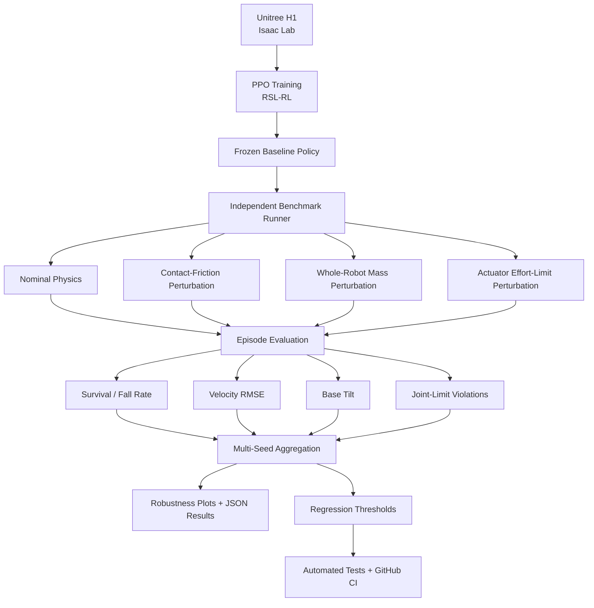
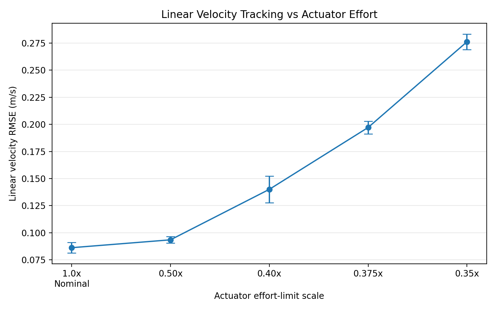

# Humanoid Simulation Robustness Benchmark

A reproducible **robotics simulation validation framework** for Unitree H1 humanoid locomotion in NVIDIA Isaac Lab.

I trained and froze an H1 PPO locomotion policy, then built an independent benchmark around it to measure how controller performance changes under controlled **physics, model, and actuator mismatch**.

**55 simulation runs · 5,500 evaluated episodes · 11 simulation conditions · 5 evaluation seeds · 43 automated tests + CI**

## What This Project Demonstrates

- GPU-parallel humanoid simulation and PPO training in Isaac Lab
- independent evaluation infrastructure around a frozen controller
- controlled contact-friction, whole-robot mass, and actuator-effort perturbations
- survival, velocity-tracking, base-tilt, and joint-limit metrics
- automated multi-seed experiments and statistical aggregation
- configuration-driven and resumable benchmark execution
- regression thresholds, 43 automated tests, and GitHub Actions CI

## Key Results

The frozen controller remained highly stable under moderate mismatch, while quantitative metrics exposed progressive degradation as the simulated system moved further from the nominal model.

- contact friction `0.4 / 0.3`: **99.8% survival**, although yaw-tracking error had already increased
- contact friction `0.3 / 0.2`: survival decreased to **81.8%**
- contact friction `0.2 / 0.15`: survival decreased to **0%**
- whole-robot mass scaling `1.0x → 1.6x`: survival decreased from **99.8% → 67.2%**
- actuator effort scaling `1.0x → 0.35x`: survival decreased from **99.8% → 38.0%**
- actuator linear-velocity RMSE increased from approximately **0.086 → 0.276 m/s**

This project treats simulation as an **engineering validation, stress-testing, and regression-testing environment**, rather than only as a place to train an RL policy.

## Project Scope

The H1 robot model, locomotion task, observations, actions, reward structure, termination logic, and PPO implementation come from Isaac Lab / RSL-RL.

The original contribution of this repository is the engineering infrastructure around the trained controller: independent evaluation, controlled model perturbations, quantitative metrics, multi-seed experiments, statistical analysis, regression checks, automated tests, and reproducible benchmark tooling.

## Benchmark Architecture



## Simulation Demo

### Nominal H1 Locomotion

The frozen PPO policy running in NVIDIA Isaac Lab across parallel Unitree H1 environments.


## What Comes From Isaac Lab / RSL-RL

- Unitree H1 robot model
- `Isaac-Velocity-Flat-H1-v0` locomotion environment
- observation and action definitions
- built-in reward terms
- task termination logic
- RSL-RL PPO implementation

## What Is Implemented in This Project

- trained and froze a dedicated H1 locomotion policy
- external benchmark runner independent of the standard playback script
- YAML-based benchmark configuration
- episode-consistent metric collection
- timeout-survival versus early-termination classification
- velocity-tracking RMSE aligned with the H1 task coordinate frames
- mean base-tilt measurement
- soft joint-limit violation tracking
- deterministic contact-friction perturbations
- deterministic whole-robot mass scaling with inertia recomputation
- deterministic whole-robot actuator effort-limit scaling
- automated friction, mass, and actuator-effort experiments
- resumable multi-seed benchmark execution
- statistical aggregation across evaluation seeds
- JSON result export
- robustness plotting utilities
- regression thresholds for benchmark results
- simulator-independent validation logic
- CPU-only automated tests
- GitHub Actions CI

## Baseline Policy

The benchmark uses a policy trained specifically for this project rather than an externally supplied pretrained checkpoint.

| Parameter | Value |
|---|---:|
| Robot | Unitree H1 |
| Task | `Isaac-Velocity-Flat-H1-v0` |
| Algorithm | PPO — RSL-RL |
| Parallel training environments | 1024 |
| Training iterations | 1500 |
| Total environment transitions | 36,864,000 |
| Training seed | 42 |
| Final mean reward | 30.96 |
| Final mean episode length | 993.30 |
| Training throughput | ~25,577 steps/s |
| Training time | ~27 min |

Frozen policy:

```text
baseline_checkpoints/baseline_v1.pt
```

Policy metadata:

```text
baseline_checkpoints/baseline_v1.yaml
```

## Nominal Benchmark

A finalized nominal benchmark was run for **100 completed episodes across 64 vectorized environments**.

| Metric | Result |
|---|---:|
| Survival rate | **100.00%** |
| Fall rate | **0.00%** |
| Mean episode length | **1000.00 steps** |
| Linear velocity RMSE | **0.0807 m/s** |
| Yaw velocity RMSE | **0.1395 rad/s** |
| Mean base tilt | **2.99°** |
| Joint-limit violation rate | **0.0979%** |

A successful episode is defined as:

```text
survival_to_timeout
```

The robot must reach the configured episode time limit without an early termination.

Therefore, **survival rate is a locomotion-stability metric, not a navigation-goal success metric**.

The standalone nominal benchmark above is a single finalized evaluation. The multi-seed nominal numbers below represent statistics across five independent evaluation seeds.

# Multi-Seed Robustness Evaluation

The same frozen controller was evaluated under multiple controlled simulation conditions.

Evaluation protocol:

- **5 evaluation seeds:** `42`, `123`, `456`, `789`, `2026`
- **11 simulation scenarios**
- **100 completed episodes per scenario / seed**
- **55 total simulation runs**
- **5,500 evaluated episodes**
- **64 parallel environments per run**

Reported uncertainty is:

```text
mean ± sample standard deviation across evaluation seeds
```

The error bars represent variation across the five evaluation seeds. They are not confidence intervals or statistical-significance claims.

## Contact-Friction Robustness

The robot rigid-body contact material was modified while the frozen controller remained unchanged.


| Static / Dynamic Friction | Survival Rate |
|---|---:|
| Nominal `0.8 / 0.6` | **99.8 ± 0.45%** |
| `0.4 / 0.3` | **99.8 ± 0.45%** |
| `0.3 / 0.2` | **81.8 ± 4.76%** |
| `0.2 / 0.15` | **0.0 ± 0.0%** |

The tested friction range shows a clear transition from stable locomotion to severe degradation.

This is an **observed transition region in the tested parameter grid**, not a universal physical failure threshold for Unitree H1.

### Yaw Tracking


| Static / Dynamic Friction | Yaw RMSE |
|---|---:|
| Nominal | **0.141 ± 0.002 rad/s** |
| `0.4 / 0.3` | **0.173 ± 0.002 rad/s** |
| `0.3 / 0.2` | **0.310 ± 0.021 rad/s** |
| `0.2 / 0.15` | **0.684 ± 0.042 rad/s** |

At `0.4 / 0.3`, survival remains almost identical to nominal while yaw-tracking error has already increased.

This demonstrates why **continuous controller-performance metrics can expose degradation before binary fall-rate metrics do**.

## Whole-Robot Mass-Model Mismatch

Every rigid-body mass in the H1 articulation was uniformly scaled while inertia was recomputed.

The policy and actuator limits remained unchanged.


| Whole-Robot Mass Scale | Survival Rate |
|---|---:|
| `1.0x` | **99.8 ± 0.45%** |
| `1.2x` | **96.6 ± 1.82%** |
| `1.4x` | **85.2 ± 3.77%** |
| `1.6x` | **67.2 ± 5.12%** |

Within the tested range, mass mismatch produced progressive degradation rather than the sharper transition observed in the tested friction grid.

The mass range is intentionally broad and should be interpreted as a **simulation stress test**, not as a realistic manufacturing-tolerance model.

### Linear Velocity Tracking


| Whole-Robot Mass Scale | Linear Velocity RMSE |
|---|---:|
| `1.0x` | **0.086 ± 0.005 m/s** |
| `1.2x` | **0.111 ± 0.015 m/s** |
| `1.4x` | **0.169 ± 0.014 m/s** |
| `1.6x` | **0.248 ± 0.010 m/s** |

### Joint-Limit Behavior


Larger mass mismatch was also associated with increased soft joint-limit violations.

The benchmark measures this association but does not claim that increased mass alone is the isolated causal mechanism.

## Actuator Effort-Limit Robustness

The frozen policy was evaluated while uniformly reducing the simulated effort limits of the H1 actuator groups.

The H1 actuator configuration contains separate actuator groups for:

- legs
- feet
- arms

For this experiment, their effort limits were uniformly scaled while:

- the neural-network policy remained unchanged
- actuator stiffness remained unchanged
- actuator damping remained unchanged
- the robot mass model remained unchanged

This isolates **available actuator authority** as the controlled perturbation.

It should be interpreted as a **whole-robot actuator-authority stress test**, not as a model of one specific real motor fault.

### Survival


| Actuator Effort-Limit Scale | Survival Rate |
|---|---:|
| `1.0x` | **99.8 ± 0.45%** |
| `0.50x` | **98.6 ± 0.55%** |
| `0.40x` | **86.8 ± 6.26%** |
| `0.375x` | **61.6 ± 3.85%** |
| `0.35x` | **38.0 ± 2.65%** |

The controller remains highly robust at half of the nominal effort limit, but performance begins degrading strongly below that point in the tested grid.

The tested range shows an **observed degradation region around `0.35x–0.40x` actuator effort**, but this must not be interpreted as a universal physical actuator threshold for Unitree H1.

### Linear Velocity Tracking



| Actuator Effort-Limit Scale | Linear Velocity RMSE |
|---|---:|
| `1.0x` | **0.086 ± 0.005 m/s** |
| `0.50x` | **0.094 ± 0.003 m/s** |
| `0.40x` | **0.140 ± 0.012 m/s** |
| `0.375x` | **0.197 ± 0.006 m/s** |
| `0.35x` | **0.276 ± 0.007 m/s** |

The other continuous metrics show the same general degradation trend.

Yaw velocity RMSE increased from:

```text
0.141 rad/s nominal
→
0.327 rad/s at 0.35x actuator effort
```

Mean base tilt increased from:

```text
3.03°
→
5.39°
```

Joint-limit violation rate also increased substantially as available actuator effort was reduced.

Together, these metrics show that reduced actuator authority causes **progressive controller degradation rather than only a binary fall/no-fall transition**.

# Key Findings

1. **Controller degradation can be measured before complete locomotion failure.**

2. **Contact-friction mismatch produced a sharp failure transition within the tested range.**

3. **Whole-robot mass mismatch produced progressive degradation across survival and velocity-tracking performance.**

4. **Reduced actuator authority produced a clear degradation region: survival decreased from 98.6% at `0.50x` effort to 38.0% at `0.35x`.**

5. **Continuous metrics such as velocity RMSE, base tilt, and joint-limit violations provide information that binary survival alone cannot capture.**

6. **The observed robustness trends were reproduced across five evaluation seeds.**

Complete aggregated statistics are stored in:

```text
docs/multiseed_aggregated_results.json
```

# Evaluation Metrics

## Survival Rate

Fraction of completed benchmark episodes that survive until the configured environment timeout.

```text
timeout → success
early termination → fall
```

## Fall Rate

Fraction of completed benchmark episodes that terminate before reaching the configured timeout.

## Linear Velocity RMSE

XY velocity-command tracking error measured in the gravity-aligned robot yaw frame.

Unit:

```text
m/s
```

## Yaw Velocity RMSE

Error between commanded yaw rate and the robot's measured world-frame z angular velocity.

Unit:

```text
rad/s
```

## Mean Base Tilt

Mean angular deviation from upright, calculated using projected gravity in the robot base frame.

```text
0° ≈ upright
```

## Joint-Limit Violation Rate

Fraction of joint-time observations lying outside the configured soft joint-position limits.

# Reproducibility

Development environment:

```text
Isaac Lab:      v2.3.2
RSL-RL:         3.1.2
Python:         3.11
GPU simulation: CUDA
```

## Run the Nominal Benchmark

```powershell
python benchmark/run_benchmark.py --config configs/baseline_nominal.yaml
```

## Run the Friction Sweep

```powershell
python scripts/run_friction_sweep.py --config configs/friction_sweep.yaml
```

## Run the Mass Sweep

```powershell
python scripts/run_mass_sweep.py --config configs/mass_sweep.yaml
```

## Run the Full Multi-Seed Benchmark

```powershell
python scripts/run_multiseed_benchmark.py --config configs/multiseed_benchmark.yaml
```

The multi-seed runner supports completed-run reuse. Valid existing results are skipped automatically, allowing interrupted experiment matrices to resume without repeating successful runs.

Preview the planned matrix without launching Isaac Sim:

```powershell
python scripts/run_multiseed_benchmark.py --config configs/multiseed_benchmark.yaml --dry-run
```

Force all conditions to run again:

```powershell
python scripts/run_multiseed_benchmark.py --config configs/multiseed_benchmark.yaml --force
```

## Aggregate Multi-Seed Results

```powershell
python scripts/aggregate_multiseed_results.py
```

## Generate Friction and Mass Plots

```powershell
python scripts/plot_multiseed_results.py
```

## Generate Actuator Robustness Plots

```powershell
python scripts/plot_actuator_multiseed.py
```

# Tests and CI

The simulator-independent benchmark logic is covered by **43 automated tests**.

Run locally:

```powershell
python -m pytest tests -q
```

The tests cover areas including:

- benchmark configuration validation
- physics-modification validation
- friction parameter validation
- mass-scale validation
- actuator effort-scale validation
- episode termination classification
- success/fall-rate calculations
- RMSE calculation
- statistical aggregation
- regression-threshold behavior

Run the nominal regression check:

```powershell
python scripts/check_regression.py
```

Regression thresholds are defined in:

```text
configs/regression_thresholds.yaml
```

GitHub Actions automatically runs the CPU-only validation pipeline on pushes and pull requests.

The CI workflow intentionally does **not** launch Isaac Sim.

Instead:

```text
CPU CI
│
├── configuration validation
├── metric logic
├── aggregation logic
├── regression checks
└── automated tests

GPU benchmark stage
│
└── Isaac Lab simulation
```

This separation keeps simulator-independent infrastructure continuously testable while GPU simulation remains an explicit benchmark stage.

# Repository Structure

```text
Humanoid-Benchmark/
│
├── .github/
│   └── workflows/
│       └── ci.yml
│
├── baseline_checkpoints/
│   ├── baseline_v1.pt
│   └── baseline_v1.yaml
│
├── benchmark/
│   ├── __init__.py
│   ├── aggregation.py
│   ├── core.py
│   ├── regression.py
│   └── run_benchmark.py
│
├── configs/
│   ├── baseline_nominal.yaml
│   ├── friction_sweep.yaml
│   ├── mass_sweep.yaml
│   ├── multiseed_benchmark.yaml
│   └── regression_thresholds.yaml
│
├── docs/
│   ├── multiseed_aggregated_results.json
│   │
│   └── assets/
│       ├── h1_nominal_demo.gif
│       ├── multiseed_friction_success_rate.png
│       ├── multiseed_friction_yaw_rmse.png
│       ├── multiseed_mass_success_rate.png
│       ├── multiseed_mass_linear_rmse.png
│       ├── multiseed_mass_joint_limit_violations.png
│       ├── multiseed_actuator_success_rate.png
│       └── multiseed_actuator_linear_rmse.png
│
├── reports/
│   ├── baseline_v1_nominal/
│   └── multiseed/
│
├── scripts/
│   ├── aggregate_multiseed_results.py
│   ├── check_regression.py
│   ├── compare_results.py
│   ├── plot_actuator_multiseed.py
│   ├── plot_friction_sweep.py
│   ├── plot_mass_sweep.py
│   ├── plot_multiseed_results.py
│   ├── run_friction_sweep.py
│   ├── run_mass_sweep.py
│   └── run_multiseed_benchmark.py
│
├── tests/
│   ├── test_aggregation.py
│   ├── test_core.py
│   └── test_regression.py
│
└── requirements-ci.txt
```

Generated per-seed benchmark configurations and raw experiment outputs are intentionally omitted from the simplified tree above.

# Tools and Technologies

- NVIDIA Isaac Sim
- NVIDIA Isaac Lab
- Unitree H1
- RSL-RL
- PPO
- PyTorch
- Gymnasium
- Python
- YAML
- Matplotlib
- PyTest
- GitHub Actions
- CUDA GPU simulation

# Engineering Focus

The purpose of this project is not to claim a new reinforcement-learning algorithm.

The project focuses on a different robotics-engineering question:

> **How can a trained locomotion controller be systematically validated when the simulation model no longer exactly matches the model it was trained on?**

The benchmark approaches that question through controlled perturbations, quantitative evaluation, repeated experiments, statistical aggregation, reproducibility, regression checks, and automated software validation.